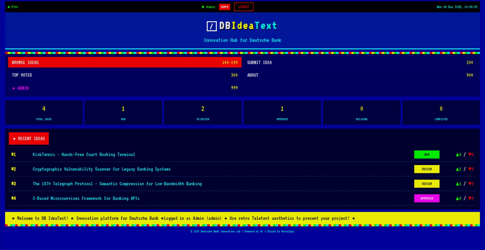
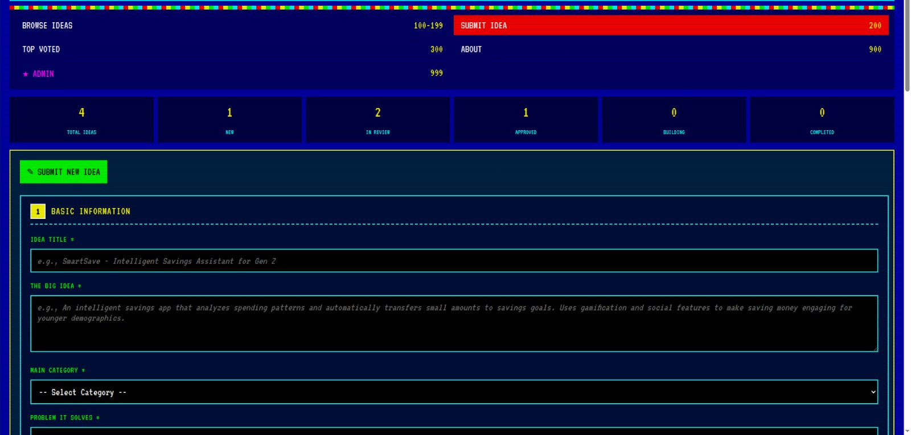
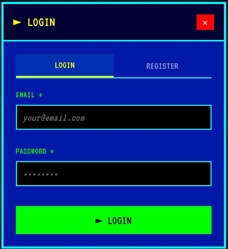
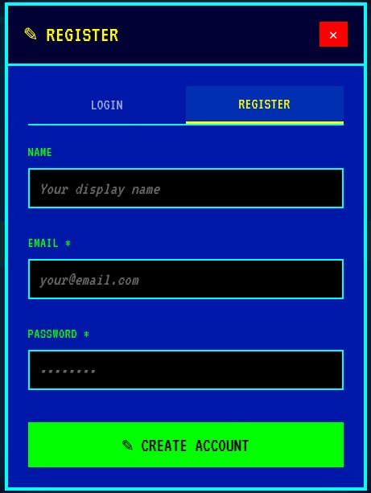
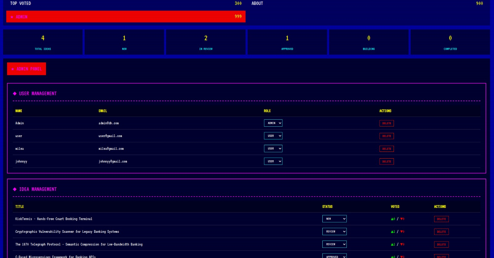

<div align="center">

# **DBIdeaText**

*Revolutionizing Idea Crowdsourcing with Retro Teletext Aesthetics*

[](https://github.com/johnnyy06/banking-ideas)
[](https://github.com/johnnyy06/banking-ideas)
[](https://github.com/johnnyy06/banking-ideas)

### Built with the tools and technologies:


---

### Built by:

[](https://github.com/Aless2303)
[](https://github.com/antonioheasca4)
[](https://github.com/johnnyy06)

</div>

---

## 📺 Overview

**DB IdeaText** is an innovative platform where developers from around the world can present their ideas using the nostalgic aesthetics of the **Teletext service** from the 80s and 90s.

This web application brings back the retro charm of Teletext while leveraging modern technologies like **AI-powered analysis**, **Next.js**, and **real-time voting systems** to create a unique crowdsourcing experience.

---

## 📸 Screenshots

<div align="center">

| Dashboard | Submit Idea |
|:---------:|:-----------:|
|  |  |

| Login | Register |
|:------------:|:-----------:|
|  |  |

| Admin Tab | AI Pipeline |
|:------------:|:-----------:|
|  |  |

</div>

---

## ✨ Features

- 🎨 **Retro Teletext Design** - Authentic CRT overlay effects, mosaic borders, and pixel-perfect aesthetics
- 🤖 **AI-Powered Analysis** - Multi-agent pipeline that analyzes ideas from technical, business, and regulatory perspectives
- 📊 **Community Voting** - Like/dislike system for community-driven idea evaluation
- 👤 **User Roles** - Guest, User, and Admin with different permissions
- 🔗 **GitHub Integration** - Link your repositories directly to your ideas
- 📈 **Idea Status Flow** - Track progress: NEW → REVIEW → APPROVED → BUILD → COMPLETED

---

## 🛠️ Tech Stack

| Category | Technologies |
|----------|-------------|
| **Frontend** | React, Next.js, TypeScript, Tailwind CSS |
| **Backend** | Next.js API Routes, Drizzle ORM |
| **Database** | PostgreSQL |
| **AI** | Anthropic Claude |
| **Auth** | NextAuth.js |
| **Forms** | React Hook Form, Zod |
| **Styling** | Custom Teletext CSS, Framer Motion |

---

## 🚀 Getting Started

### Prerequisites

- Node.js 18+
- PostgreSQL database
- Anthropic API key

### Installation

```bash
# Clone the repository
git clone https://github.com/Aless2303/DB_JoJoMii.git

# Navigate to project directory
cd banking-ideas

# Install dependencies
npm install

# Set up environment variables (copy and add your variables)
cp .env.example .env

# Start database
docker compose up -d

# Start development server
npm run dev
```

---

## 🎯 How It Works

1. **Describe your idea** in detail using our retro form
2. **Our AI automatically generates** a visual mockup in Teletext style
3. **Attach your GitHub link** with your project
4. **The community votes** for the best ideas (like/dislike)
5. **DB teams evaluate** and adopt promising projects

---

## 🤖 AI Pipeline

The platform features a sophisticated multi-agent AI system:

| Agent | Role |
|-------|------|
| **Basic Info Analyzer** | Creates headlines, taglines, and key benefits |
| **Technologies Analyzer** | Evaluates tech stack and innovation level |
| **Business Analyzer** | Assesses market opportunity and revenue model |
| **Regulations Analyzer** | Checks compliance with GDPR, PSD2, DORA |
| **Differentiators Analyzer** | Identifies unique selling points |
| **Visual Designer** | Generates Teletext-style presentations |

---

## 📁 Project Structure

```
banking-ideas/
├── app/                    # Next.js App Router
│   ├── api/               # API routes
│   ├── ideas/             # Idea pages
│   └── page.tsx           # Main page
├── components/            # React components
├── lib/
│   ├── ai/               # AI agents and orchestration
│   └── db/               # Database schemas
├── public/               # Static assets
└── styles/               # Teletext CSS
```

---

## 🔗 Related Repositories

### Innovative Ideas

1. **[The 1870 Telegraph Protocol](https://github.com/antonioheasca4/1870-telegraph-protocol)**  
   Semantic compression for maritime banking

2. **[Stankowski's Frame](https://github.com/antonioheasca4/Stankowski-s-Frame)**  
   Visual compression for geometric encoding - Inspired by Anton Stankowski's geometric art

---

<div align="center">

**Powered by AI | Styled by Nostalgia**

</div>
